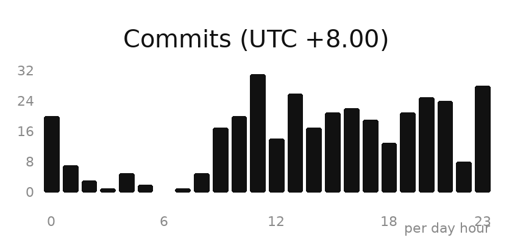

<!--
  IvanCodesDev GitHub Profile README
  Place this file at: IvanCodesDev/IvanCodesDev/README.md
  Keep the /assets icons in the same repository.
-->

# Hi, I'm Ivan 

I build software, AI systems, and AI products — turning ideas into things people can actually use.

- 🤖 Exploring Agents, Agent Infrastructure, and AI-native systems
- 🧠 Learning and researching LLM algorithms, pre-training, machine learning, and deep learning
- 🏗️ Building AI products and exploring Harness Engineering for reliable AI systems
- 🌍 Creating AI solutions that combine artificial intelligence with different domains
- 🧩 Interested in AI Infra, software architecture, and the future of intelligent products
- ✍️ Sharing my experiments, insights, and technical knowledge through writing and open source
- 🤝 Open to collaborating on AI, software engineering, and open-source projects

Always learning. Always building.

  &nbsp;Total Stars&nbsp;<b><!--STAT:stars-->183<!--/STAT:stars--></b>
  &nbsp;&nbsp;&nbsp;
  &nbsp;Followers&nbsp;<b><!--STAT:followers-->28<!--/STAT:followers--></b>
  &nbsp;&nbsp;&nbsp;
  &nbsp;Repos&nbsp;<b><!--STAT:repos-->10<!--/STAT:repos--></b>

---

## Featured Projects

<table>
  <tr>
    <td width="50%" valign="top">
      <h3><a href="https://github.com/IvanCodesDev/software-certificate-skill">software-certificate-skill</a></h3>
      
Agent Skill that auto-generates software copyright application forms, user manuals, technical docs, and code materials.

      

        &nbsp;<!--STAT:software-certificate-skill:stars-->150<!--/STAT:software-certificate-skill:stars-->
        &nbsp;&nbsp;&nbsp;
        &nbsp;<!--STAT:software-certificate-skill:forks-->10<!--/STAT:software-certificate-skill:forks-->
      

    </td>
    <td width="50%" valign="top">
      <h3><a href="https://github.com/IvanCodesDev/ForgeX">ForgeX</a></h3>
      
Physics-driven 3D printing simulator for slicing, thermal control, telemetry, and failure analytics.

      

        &nbsp;<!--STAT:ForgeX:stars-->17<!--/STAT:ForgeX:stars-->
        &nbsp;&nbsp;&nbsp;
        &nbsp;<!--STAT:ForgeX:forks-->1<!--/STAT:ForgeX:forks-->
      

    </td>
  </tr>
  <tr>
    <td width="50%" valign="top">
      <h3><a href="https://github.com/IvanCodesDev/OmniSpeed">OmniSpeed</a></h3>
      
Global video speed controller — browser extension + desktop app that speeds up any player, up to 16×.

      

        &nbsp;<!--STAT:OmniSpeed:stars-->7<!--/STAT:OmniSpeed:stars-->
        &nbsp;&nbsp;&nbsp;
        &nbsp;<!--STAT:OmniSpeed:forks-->1<!--/STAT:OmniSpeed:forks-->
      

    </td>
    <td width="50%" valign="top">
      <h3><a href="https://github.com/IvanCodesDev/OpenMathModel">OpenMathModel</a></h3>
      
AI agent for mathematical modeling — problem parsing, analysis, experiments, validation, and paper generation.

      

        &nbsp;<!--STAT:OpenMathModel:stars-->5<!--/STAT:OpenMathModel:stars-->
        &nbsp;&nbsp;&nbsp;
        &nbsp;<!--STAT:OpenMathModel:forks-->2<!--/STAT:OpenMathModel:forks-->
      

    </td>
  </tr>
  <tr>
    <td width="50%" valign="top">
      <h3><a href="https://github.com/IvanCodesDev/Nivik">Nivik</a></h3>
      
Turn ideas into editable diagrams — an AI-native canvas for thinking in pictures.

      

        &nbsp;<!--STAT:Nivik:stars-->1<!--/STAT:Nivik:stars-->
        &nbsp;&nbsp;&nbsp;
        &nbsp;<!--STAT:Nivik:forks-->0<!--/STAT:Nivik:forks-->
      

    </td>
    <td width="50%" valign="top">
      <h3><a href="https://github.com/IvanCodesDev/CiteBase">CiteBase</a></h3>
      
Compile-first knowledge base for AI agents and teams — verifiable citations, drift detection, and Git-based governance.

      

        &nbsp;<!--STAT:CiteBase:stars-->1<!--/STAT:CiteBase:stars-->
        &nbsp;&nbsp;&nbsp;
        &nbsp;<!--STAT:CiteBase:forks-->0<!--/STAT:CiteBase:forks-->
      

    </td>
  </tr>
</table>

---

## Projects by Category

### Open Source Projects

| Project | Description | Stars | Forks |
|:--------|:------------|------:|------:|
| [ForgeX](https://github.com/IvanCodesDev/ForgeX) | Physics-driven 3D printing simulator | 17 | 1 |
| [OmniSpeed](https://github.com/IvanCodesDev/OmniSpeed) | Global video speed controller (browser + desktop) | 6 | 1 |
| [Nivik](https://github.com/IvanCodesDev/Nivik) | Turn ideas into editable diagrams | 1 | 0 |
| [OpenMathModel](https://github.com/IvanCodesDev/OpenMathModel) | AI agent for mathematical modeling & paper generation | 3 | 2 |
| [CiteBase](https://github.com/IvanCodesDev/CiteBase) | Compile-first knowledge base with verifiable citations | 1 | 0 |

> More projects coming soon.

### Agent Skills

| Project | Description | Stars | Forks |
|:--------|:------------|------:|------:|
| [software-certificate-skill](https://github.com/IvanCodesDev/software-certificate-skill) | Auto-generate software copyright registration materials | 143 | 9 |

> More agent skills coming soon.

### Tutorials

| Project | Description | Stars | Forks |
|:--------|:------------|------:|------:|
| [Agent-Handbook](https://github.com/IvanCodesDev/Agent-Handbook) | Handbook for building and working with AI agents | 1 | 0 |

> More tutorials coming soon.

---

## Skills

Languages, frameworks, and domains I work with most.

  
  
  
  
  
  
  
  
  
  
  
  
  
  
  

## Tools

Daily tools in my workflow.

<table>
  <tr>
    <td width="111" align="center" valign="middle"></td>
    <td width="111" align="center" valign="middle"></td>
    <td width="111" align="center" valign="middle"></td>
    <td width="111" align="center" valign="middle"></td>
    <td width="111" align="center" valign="middle"></td>
    <td width="111" align="center" valign="middle"></td>
    <td width="111" align="center" valign="middle"></td>
    <td width="111" align="center" valign="middle"></td>
  </tr>
  <tr>
    <td width="111" align="center" valign="middle"></td>
    <td width="111" align="center" valign="middle"></td>
    <td width="111" align="center" valign="middle"></td>
    <td width="111" align="center" valign="middle"></td>
    <td width="111" align="center" valign="middle"></td>
    <td width="111" align="center" valign="middle"></td>
    <td width="111" align="center" valign="middle"></td>
    <td width="111" align="center" valign="middle"></td>
  </tr>
</table>

---

## GitHub Stats

<!-- Live: each image is generated from GitHub data by a public API (brief CDN cache possible). -->

  
  

<!-- Contribution heatmap with snake animation, regenerated daily by .github/workflows/snake.yml -->

  <picture>
    <source media="(prefers-color-scheme: dark)" srcset="https://raw.githubusercontent.com/IvanCodesDev/IvanCodesDev/output/github-contribution-grid-snake-dark.svg" />
    
  </picture>

---

## Connect

Find me elsewhere:

  

  
  
  

 

Thanks for stopping by — feel free to explore, star, or open an issue.

  

